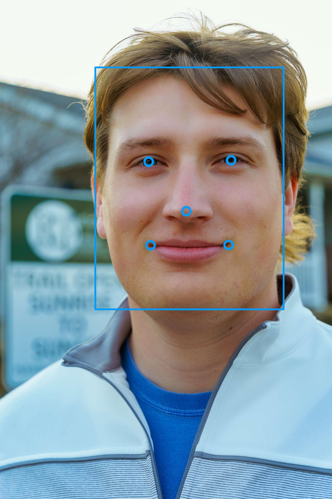

<h1 align="center">
   TensorFlow Unqiue Face Detection
</h1>
<p align="center">
   An implementation of a TensorFlow model to identify images containing certain faces
 </p>
 <p align="center">
  This project was for Special Topics: Computer Vision class at UMBC (CMSC 491).
</p>

## Installation

#### _Required_
* You'll need to have a 64 bit python installation (3.6 - 3.8) along with the following libraies:
    - tensorflow 
    - numpy 
    - opencv2
    - ~~[facetnet](https://github.com/davidsandberg/facenet) (possibly this one? [alt](https://github.com/jonaphin/facenet))~~ Included locally because it needed changes specific to this project
    - imageio 
    - scikit-image 
    - Pillow (PIL) 
    - matplotlib
    
#### _Optional_
* These libraries are used in the research code
    - [mtcnn](https://github.com/ipazc/mtcnn) 
    
## Execution

1. Find at least 5 target images for at least two people and place them into their own folder in the input directory
2. Run `gen_v2.py` in TRAIN mode to generate a classifier
    * If you are using pycharm this can be done by selecting `TRAIN_gen_v2` as your configuration
    * Command line structure is as follows:
        * ```shell
            python gen_v2.py TRAIN input models/20180402-114759.pb models/my_classifier.pkl --batch_size 1000
            ```
3. Run `gen_v2.py` in CLASSIFY mode to test your new classifier
    * If you are using pycharm this can be done by selecting `CLASSIFY_gen_v2` as your configuration
    * Command line structure is as follows:
        * ```shell
            python gen_v2.py CLASSIFY input models/20180402-114759.pb models/my_classifier.pkl --batch_size 1000
            ```
4. _???_
5. **profit**

