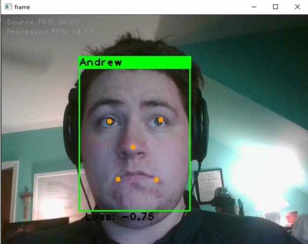

<h1 align="center">
   Adaptive Home Surveillance Through Computer Vision
</h1>
<p align="center">
   A TensorFlow project based on Inception ResNet v2 to dynamically detect new faces
 </p>
 <p align="center">
  This project was for Special Topics: Computer Vision class at UMBC (CMSC 491).
</p>


## Installation

#### _Required_

* You'll need to have a 64 bit python installation (3.6 - 3.8) along with the following libraies:
    - tensorflow
    - numpy
    - opencv2
    - mtcnn_opencv
    
#### _Optional_

* Setting up tensorflow to work with your gpu(s) will greatly speed up performance
    - [GPU Support](https://www.tensorflow.org/install/gpu)

## Execution

1. Find at least 5 target images for at least two people and place them into their own folder in the input directory
2. Run `generate_classifier.py` to generate a classifier
    * If you are using pycharm this can be done by selecting `generate_classifier` or `generate_classifier_verbose` as
      your configuration
    * Command line structure is as follows:
        * ```shell
            python generate_classifier.py -v 1
            ```
3. Run `primary.py` to run the main program
    * If you are using pycharm this can be done by selecting `primary` or `primary_verbose` as your configuration
    * Command line structure is as follows:
        * ```shell
            python primary.py -v 1
            ```
4. _???_
5. **profit**

## Results

Chase Only


Andrew Only



Andrew and Unrecognized


